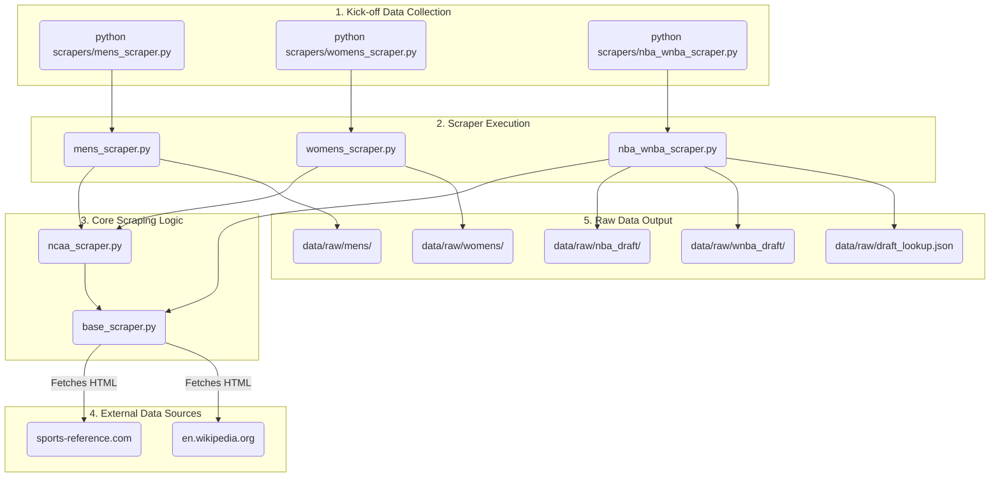

# AI Tournament Predictions

> Have not watched a single college basketball game this year so I will instead be doing some basic DS and AI dev work to make all the predictions for me.

A data-driven NCAA March Madness bracket prediction system covering both the Men's and Women's tournaments. Uses historical data (2014–2024), advanced analytics, and machine learning to generate bracket picks.

---

## Architecture Overview

```
AI-Tournament-Predictions/
├── data/
│   ├── raw/                  # Scraped source data (JSON/HTML cache)
│   ├── processed/            # Cleaned, feature-engineered data
│   │   ├── mens/             # Per-year YAML files for men's tournament
│   │   └── womens/           # Per-year YAML files for women's tournament
│   └── trends/               # Computed historical trend summaries
├── scrapers/
│   ├── mens_scraper.py       # Men's tournament data scraper
│   ├── womens_scraper.py     # Women's tournament data scraper
│   └── nba_wnba_scraper.py  # NBA/WNBA draft data for prospect tagging
├── processing/
│   ├── feature_engineering.py  # Build feature vectors from YAML data
│   ├── trend_analysis.py       # Historical win-rate trends by seed, conf, etc.
│   └── yaml_writer.py          # Normalize and write processed YAML output
├── models/
│   ├── mens_model.py           # Men's tournament prediction model
│   ├── womens_model.py         # Women's tournament prediction model
│   ├── train.py                # Training entrypoint
│   └── evaluate.py             # Backtesting / accuracy evaluation
├── bracket/
│   ├── simulate.py             # Full bracket simulation (run N times)
│   ├── output_bracket.py       # Generate printable bracket output
│   └── brackets/               # Generated bracket submissions (JSON/CSV)
├── requirements.txt
└── README.md
```

---

## Component 1 — Data Scrapers

**Goal:** Pull 10 years of Men's and Women's NCAA tournament data and write it to YAML.

### Data Sources
| Source | What we pull |
|---|---|
| Sports-Reference (basketball-reference.com / sports-reference.com/cbb) | Team stats, season records, advanced metrics (SRS, SOS, ORtg, DRtg, Pace) |
| NCAA.com / NCAA API | Bracket structure, seed assignments, game-by-game results |
| ESPN API (unofficial) | Additional game logs, team metadata |
| NBA.com / RealGM | NBA draft classes to tag tournament rosters |
| Her Hoop Stats / sports-reference WCBB | Women's equivalent stats |

### Features Captured Per Team Per Year
- **Seed & Region**
- **Conference** — conference champion flag, regular season title flag
- **Season Record** (overall W-L, conference W-L)
- **Strength of Schedule (SOS)** — numerical rank
- **Advanced Metrics** — SRS, ORtg, DRtg, Pace, eFG%, TOV%, ORB%, FT rate
- **Tournament Performance** — round reached, wins, upsets caused, upsets suffered
- **NBA/WNBA Prospect Count** — # of players on roster drafted within 3 years
- **Coach Experience** — years coaching, prior tournament appearances
- **Momentum** — last 10 games W-L entering tournament

### YAML Schema (per team per year)
```yaml
year: 2023
tournament: mens
team: "Alabama"
seed: 1
region: "South"
conference: "SEC"
conf_champion: true
conf_tournament_champion: false
record:
  overall: "31-6"
  conference: "17-1"
strength_of_schedule:
  rank: 12
  rating: 11.23
advanced:
  srs: 18.4
  offensive_rating: 114.2
  defensive_rating: 95.8
  pace: 72.1
  efg_pct: 0.548
  tov_pct: 0.142
  orb_pct: 0.318
  ft_rate: 0.342
momentum:
  last_10: "8-2"
nba_prospects: 3
coach:
  name: "Nate Oats"
  years_experience: 12
  prior_tournament_appearances: 5
tournament_result:
  round_reached: "Elite Eight"
  wins: 3
  losses: 1
  upset_caused: false
  upset_suffered: false
```

### Data Collection Flow

The data collection process is initiated by running the scraper scripts. The flow is as follows:



The `mens_scraper.py` and `womens_scraper.py` scripts are wrappers around the generic `ncaa_scraper.py`, which contains the core logic for scraping NCAA tournament data. The `nba_wnba_scraper.py` script scrapes draft data from Wikipedia. Both scrapers use `base_scraper.py` for shared functionality like HTTP requests and caching. The scraped data is saved as JSON files in the `data/raw` directory.

---

## Component 2 — Historical Trend Analysis & Modeling

**Goal:** Compute historical win probabilities and train separate models for Men's and Women's tournaments.

### Trend Analysis
- Win rates by seed matchup (1v16, 2v15, etc.)
- Conference performance by round
- Upset frequency by SOS differential
- Impact of NBA/WNBA prospect count on deep runs
- Coach experience correlation with tournament success

### Why Separate Models?
The Men's and Women's tournaments have meaningfully different dynamics:
- Parity differs — upsets are more common in one bracket historically
- Conference strength distributions differ (ACC/Big Ten dominance in WCBB)
- Draft prospect impact is weighted differently
- Sample sizes differ (Women's field expanded to 68 in 2022)

### Model Approach
| Step | Details |
|---|---|
| Feature matrix | Team A vs Team B feature differentials per matchup |
| Target | Binary win/loss outcome |
| Algorithm | Start with Logistic Regression + XGBoost ensemble; evaluate with cross-validated log-loss |
| Backtesting | Leave-one-year-out CV across 10 tournament years |
| Calibration | Platt scaling to get well-calibrated win probabilities |

---

## Component 3 — Bracket Generation

**Goal:** Use trained models to simulate the full bracket and produce a submission.

### Process
1. Load current-year team data (scraped fresh)
2. For each matchup, compute P(team A wins) via model
3. Simulate bracket N=10,000 times using those probabilities
4. Select the bracket that maximizes expected ESPN/bracket challenge score (weighted by round)
5. Output a printable bracket + machine-readable JSON/CSV

---

## Setup

```bash
python -m venv venv
source venv/bin/activate   # Windows: venv\Scripts\activate
pip install -r requirements.txt
```

### Run Order
```bash
# 1. Scrape historical data
python scrapers/mens_scraper.py --years 2014-2024
python scrapers/womens_scraper.py --years 2014-2024
python scrapers/nba_wnba_scraper.py

# 2. Process and write YAML
python processing/feature_engineering.py
python processing/trend_analysis.py

# 3. Train models
python models/train.py --gender mens
python models/train.py --gender womens

# 4. Evaluate backtesting accuracy
python models/evaluate.py

# 5. Generate bracket
python bracket/simulate.py --year 2025 --gender mens
python bracket/simulate.py --year 2025 --gender womens
python bracket/output_bracket.py
```

---

## Tech Stack

- **Python 3.11+**
- **requests / httpx** — HTTP scraping
- **BeautifulSoup4** — HTML parsing
- **pandas** — data wrangling
- **PyYAML** — YAML serialization
- **scikit-learn** — Logistic Regression, calibration, cross-validation
- **xgboost** — gradient boosting model
- **matplotlib / seaborn** — trend visualizations
