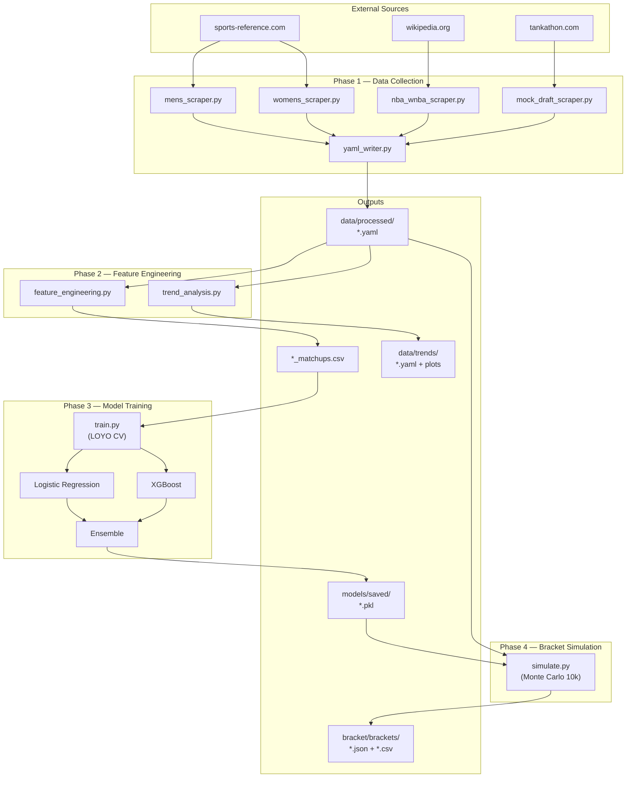
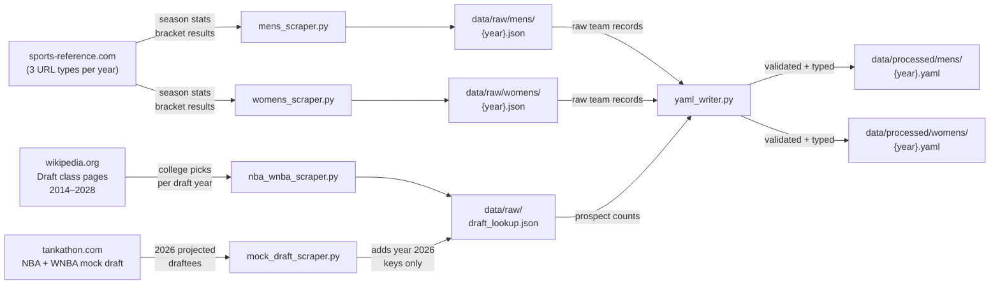
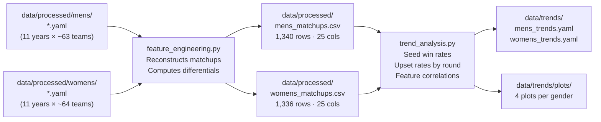
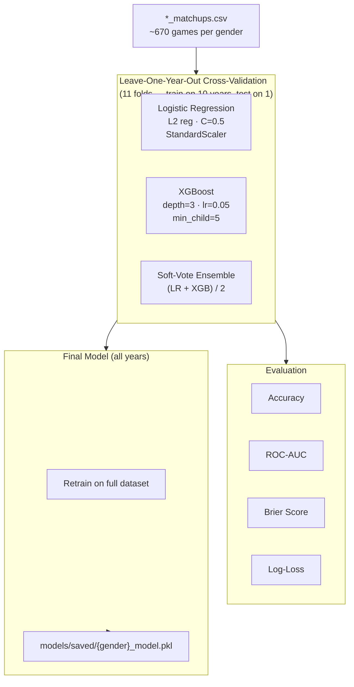
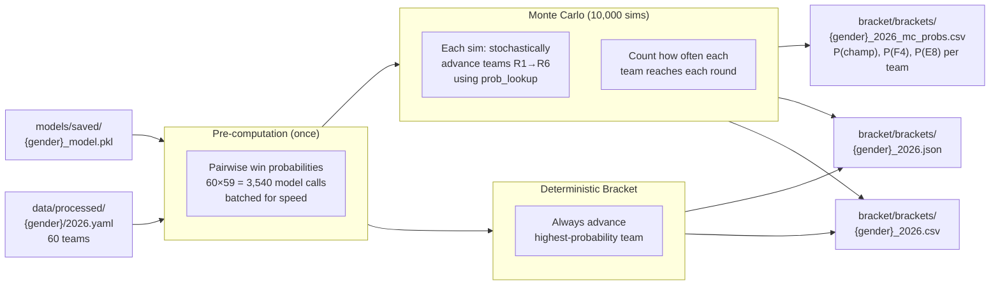

# AI Tournament Predictions 2026

> Have not watched a single college basketball game this year so I will instead be doing some basic DS and AI dev work to make all the predictions for me.

A data-driven NCAA March Madness bracket prediction system covering both the Men's and Women's tournaments. Uses historical data (2014–2025), advanced analytics, and machine learning to generate bracket picks.

---

### Status

| Phase | Status |
|---|---|
| Phase 1 — Data scraping (mens + womens, 2014–2026) | ✅ Complete |
| Phase 1 — YAML processing | ✅ Complete |
| Phase 2 — Feature engineering | ✅ Complete |
| Phase 2 — Trend analysis | ✅ Complete |
| Phase 3 — Model training | ✅ Complete |
| Phase 4 — Bracket simulation (Monte Carlo) | ✅ Complete |

---

### 2026 Predictions

**Mens — Predicted Champion: Michigan (1-seed)**

| Team | Seed | Champion% | Final Four% | Elite Eight% |
|---|---|---|---|---|
| Michigan | 1 | 55.0% | 73.6% | 83.5% |
| Duke | 1 | 25.2% | 52.6% | 76.0% |
| Arizona | 1 | 11.8% | 28.7% | 64.0% |
| Houston | 2 | 2.5% | 10.7% | 40.8% |
| Purdue | 2 | 2.0% | 9.2% | 21.4% |

Expected ESPN bracket score: **1,263 / 1,920 pts**

**Womens — Predicted Champion: UCLA (1-seed)**

| Team | Seed | Champion% | Final Four% | Elite Eight% |
|---|---|---|---|---|
| UCLA | 1 | 58.3% | 69.9% | 95.6% |
| UConn | 1 | 19.4% | 29.8% | 92.9% |
| South Carolina | 1 | 13.2% | 50.8% | 80.0% |
| Texas | 1 | 8.2% | 38.3% | 80.0% |

Expected ESPN bracket score: **1,415 / 1,920 pts**

Full game-by-game predictions: [`bracket/brackets/`](bracket/brackets/)

---

## Full Pipeline



---

## Phase 1 — Data Collection

Scrapers pull season stats, tournament results, and draft data for every tournament team from 2014–2026.

### Data Sources

| Source | Data pulled | Script |
|---|---|---|
| sports-reference.com/cbb | Advanced stats: SRS, SOS, ORtg, DRtg, Pace, eFG%, TOV%, ORB%, FT rate | `mens_scraper.py` / `womens_scraper.py` |
| sports-reference.com/cbb (ratings) | Adjusted defensive rating (separate table, merged in) | same |
| sports-reference.com/cbb (standings) | Conference affiliations, regular-season champion flags | same |
| sports-reference.com/cbb (postseason) | Seed, region, round-by-round results, upset flags | same |
| wikipedia.org | NBA / WNBA actual draft classes 2014–2025 (prospect window) | `nba_wnba_scraper.py` |
| tankathon.com | 2026 NBA / WNBA mock draft — proxy for undrafted current rosters | `mock_draft_scraper.py` |

> **Prospect counting:** each team's `nba_prospects` / `wnba_prospects` value counts players drafted within a 3-year forward window. For 2026 teams, the 2026 draft hasn't occurred yet, so Tankathon mock draft projections are used as the single-year proxy — consistent with how 2025 data was collected (2026–2028 Wikipedia draft pages were empty at scrape time).

### Phase 1 Data Flow



### YAML Schema (per team per year)

```yaml
year: 2025
tournament: mens
team: Duke
seed: 1
region: East
conference: ACC
conf_champion: true
conf_tourn_champion: true
record:
  overall: "35-4"
  conference: "19-1"
strength_of_schedule:
  rating: 10.26
advanced:
  srs: 30.72
  offensive_rating: 125.0
  defensive_rating: 86.6
  pace: 66.6
  efg_pct: 0.579
  tov_pct: 12.1
  orb_pct: 34.0
  ft_rate: 0.329
momentum:
  last_10: null
nba_prospects: 5
tournament_result:
  round_reached: Final Four
  wins: 4
  losses: 1
  upset_caused: false
  upset_suffered: false
```

> `coach` and `momentum.last_10` fields are present in schema but not populated by current scrapers.

---

## Phase 2 — Feature Engineering & Trend Analysis

### Feature Engineering

Historical matchups are reconstructed from the YAML bracket results. For each game, a row is created representing the feature *differential* between the two teams (team A minus team B), with `outcome=1` if team A won. Each game produces two mirror rows (both perspectives) for a balanced 50/50 training target.

**Rounds covered:**
- R1–R4 (First Round through Elite Eight): exact reconstruction using standard bracket seed-position structure within each region
- R6 (Championship): exact (only 2 teams)
- R5 (Final Four semis): omitted — correct pairing requires external bracket draw data not in the YAML

**Dataset sizes:** ~670 unique games → 1,340 rows per gender

### Phase 2 Data Flow



### Key Trend Findings

| Metric | Mens | Womens |
|---|---|---|
| Top predictor (correlation) | SRS diff (+0.54) | SRS diff (+0.66) |
| 2nd predictor | Seed diff (+0.48) | Seed diff (+0.64) |
| Overall feature signal | Moderate | Strong — women's tournament significantly more predictable |
| R1 upset rate | 27.9% | 17.8% |
| Elite Eight upset rate | 40.9% | 25.0% |
| 6v11 R1 win rate (lower seed) | 47.7% — coin flip | 68.2% |
| 8v9 R1 win rate (lower seed) | 47.7% — coin flip | 52.3% |
| 1-seeds in Championship (11 yr) | 8 / 11 | 9 / 11 |
| `ft_rate` correlation | −0.08 (slight negative) | +0.00 (no signal) |

---

## Phase 3 — Model Training

Separate models are trained for each gender. The women's features have ~20% higher correlations and structurally different upset dynamics, making a single combined model inappropriate.

### Architecture



### Results

| Model | Mens Accuracy | Mens AUC | Womens Accuracy | Womens AUC |
|---|---|---|---|---|
| Seed-only baseline | 70.8% | — | 78.7% | — |
| Logistic Regression | 79.0% | 0.873 | 83.7% | 0.929 |
| XGBoost | 76.8% | 0.854 | 82.0% | 0.911 |
| **Ensemble** | **80.0%** | **0.870** | **82.9%** | **0.922** |

**Per-round accuracy (Ensemble, LOYO CV):**

| Round | Mens | Womens |
|---|---|---|
| First Round | 81.8% | 83.1% |
| Second Round | 80.1% | 82.4% |
| Sweet Sixteen | 75.0% | 80.7% |
| Elite Eight | 72.7% | 84.1% |
| Championship | 72.7% | 90.9% |

**Top XGBoost feature importances:**

| Feature | Mens | Womens |
|---|---|---|
| SRS diff | 29.1% | 29.9% |
| SOS diff | 7.8% | 6.3% |
| Win % diff | 6.7% | 4.6% |
| Prospect diff | 5.4% | **12.2%** — much stronger in WNBA |
| DRtg diff | 5.3% | 6.4% |

---

## Phase 4 — Bracket Simulation

### Monte Carlo Approach



The deterministic bracket is the submitted picks (always pick the higher-probability team). The Monte Carlo layer provides the probability distribution across all teams — useful for understanding model confidence and computing expected ESPN scores.

**Expected ESPN scores** (1,920 pts maximum):
- Mens: 1,263 pts
- Womens: 1,415 pts

---

## Project Structure

```
AI-Tournament-Predictions/
├── data/
│   ├── raw/
│   │   ├── mens/              # Per-year JSON + HTML cache (2014–2026)
│   │   ├── womens/            # Per-year JSON + HTML cache (2014–2026)
│   │   ├── nba_draft/         # NBA draft class JSON (Wikipedia, 2014–2025)
│   │   ├── wnba_draft/        # WNBA draft class JSON (Wikipedia, 2014–2025)
│   │   └── draft_lookup.json  # {nba|wnba: {team: {year: prospect_count}}}
│   ├── processed/
│   │   ├── mens/              # Validated YAML per year (2014–2026)
│   │   ├── womens/            # Validated YAML per year (2014–2026)
│   │   ├── mens_matchups.csv  # Training data: feature differentials + outcome
│   │   └── womens_matchups.csv
│   └── trends/
│       ├── mens_trends.yaml   # Seed win rates, upset rates, correlations
│       ├── womens_trends.yaml
│       └── plots/             # 4 plots per gender (seed rates, upsets, corr)
├── scrapers/
│   ├── base_scraper.py        # Shared HTTP, caching, parsing utilities
│   ├── ncaa_scraper.py        # Core NCAA tournament scraper (gender-neutral)
│   ├── mens_scraper.py        # Men's tournament wrapper
│   ├── womens_scraper.py      # Women's tournament wrapper
│   ├── nba_wnba_scraper.py    # Historical draft data (Wikipedia)
│   └── mock_draft_scraper.py  # Current-year mock draft (Tankathon)
├── processing/
│   ├── yaml_writer.py         # Raw JSON + draft data → validated YAML
│   ├── feature_engineering.py # YAML → matchup CSV with feature differentials
│   └── trend_analysis.py      # Matchup CSV → trend summaries + plots
├── models/
│   ├── train.py               # LOYO CV + final model training
│   └── saved/
│       ├── mens_model.pkl     # Ensemble: LogReg + XGBoost
│       ├── womens_model.pkl
│       ├── mens_eval.yaml     # CV metrics + feature importances
│       └── womens_eval.yaml
├── bracket/
│   ├── simulate.py            # Monte Carlo + deterministic bracket simulation
│   └── brackets/
│       ├── mens_2026.json
│       ├── mens_2026.csv
│       ├── mens_2026_mc_probs.csv
│       ├── womens_2026.json
│       ├── womens_2026.csv
│       └── womens_2026_mc_probs.csv
├── requirements.txt
└── README.md
```

---

## Setup

```bash
python -m venv venv
source venv/bin/activate   # Windows: venv\Scripts\activate
pip install -r requirements.txt
```

### Run Order

```bash
# Phase 1 — Scrape historical data (2014–2025)
# sports-reference rate-limits: run sequentially, not in parallel
python scrapers/mens_scraper.py --years 2014-2025
python scrapers/womens_scraper.py --years 2014-2025
python scrapers/nba_wnba_scraper.py --min-year 2014 --max-year 2025

# Phase 1 — Current year
python scrapers/mens_scraper.py --years 2026
python scrapers/womens_scraper.py --years 2026
python scrapers/mock_draft_scraper.py   # 2026 NBA/WNBA prospect proxy

# Phase 1 — Process to YAML
python processing/yaml_writer.py        # all years, both genders

# Phase 2 — Feature engineering & trends
python processing/feature_engineering.py
python processing/trend_analysis.py

# Phase 3 — Train models
python models/train.py                  # trains both mens + womens

# Phase 4 — Generate bracket
python bracket/simulate.py              # both genders, 2026, 10k sims
python bracket/simulate.py --sims 25000 --gender mens   # higher confidence
```

---

## Tech Stack

| Library | Use |
|---|---|
| requests / httpx | HTTP scraping |
| BeautifulSoup4 | HTML parsing |
| pandas | Data wrangling, matchup construction |
| PyYAML | YAML serialization |
| scikit-learn | Logistic Regression, StandardScaler, cross-validation, metrics |
| xgboost | Gradient boosting classifier |
| matplotlib / seaborn | Trend visualizations |
| numpy | Feature matrix operations, Monte Carlo sampling |